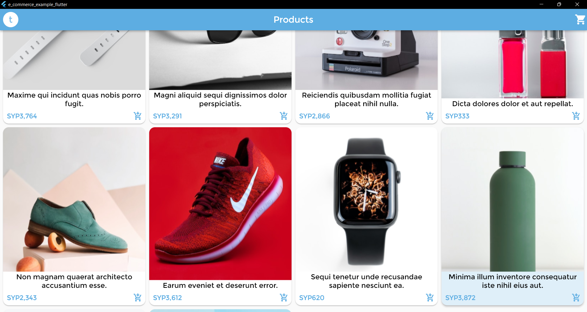
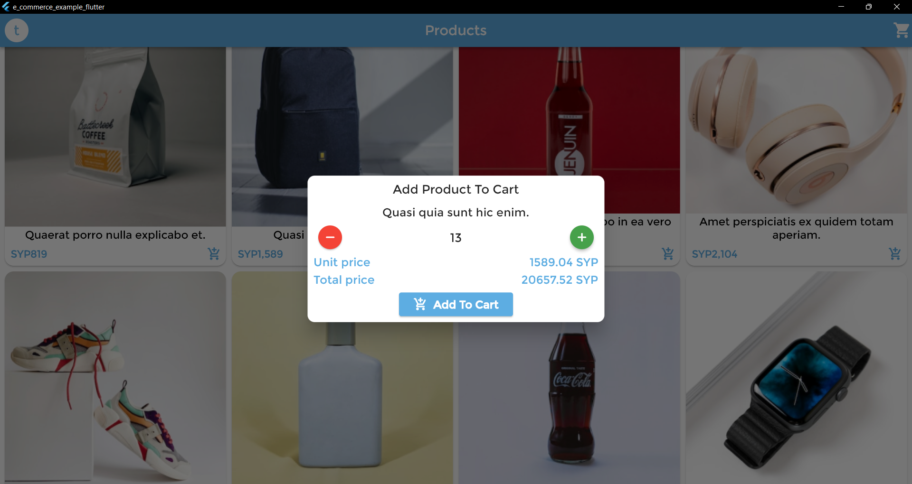

# E-Commerce-Example-Flutter
 

A flutter e-commerce application for the customers only with two languages Arabic & English which shows the products in the market, and Supports authentication operations(Register - Login - Logout), purchase, and add to the personal shopping cart.

#### Compatible with **Android, IOS, Web, Windows, MacOS** platforms.

### Features 🚀
- Register a new customer, login, logout, and saving the user token.
- Browse products and show the single product in its own page.
- Support **Pagination** to divide a document into pages.
- Add/remove a product to/from the shopping cart.
- Shows the shopping cart summary, and the purchased products. 
- Support multiple language **(Arabic - English)**.
- Adapting screen, sizes and font sizes on different screen sizes.

## Functional Description
- Designed in **Clean Architecture Pattern**.
- The used state-management is [Riverpod](https://pub.dev/packages/flutter_riverpod).
- Localization using [easy_localization](https://pub.dev/packages/easy_localization).
- Communicate with RESTful API using [dio](https://pub.dev/packages/dio).
- Modeling using [freezed](https://pub.dev/packages/freezed).
- Navigation using [fluro](https://pub.dev/packages/fluro).
- Screen adapting using [flutter_screenutil](https://pub.dev/packages/flutter_screenutil).
- [get_it](https://pub.dev/packages/get_it) is used for the dependency injection.

## Screenshots 🎉
 

Browse Products  |  Register A New Account  |  Login
:-------------------------:|:-------------------------:|:-------------------------:
  |    |  
Show Product Itself  |  Shopping Cart  |  Settings
  |    |  

 

## Apply With Your Project
- Change your base url and other routes in *lib\core\api\api_config.dart* file. 
- Your json data about **User** that retrieved from the API when send the requests (login - register - checkToken) should contains the keys like below:
```
{
  "data": {
    "id": 278,
    "name": "test user",
    "email": "nae@example.test"
  }
}
```
- Your json data about **Product** that retrieved from the API when send the requests (getProductById - getProducts) should contains the keys like below:
```
{
  "data": {
    "id": 1,
    "title": "Maxime qui incidunt quas nobis porro fugit.",
    "description": "Asperiores et nihil in sed consequatur at. Quia laboriosam ullam numquam sint unde ipsa eius. Aperiam ad necessitatibus non qui.",
    "price": {
      "value": "3764.33",
      "currency": "SYP",
      "formatted": "SYP3,764"
    },
    "image": {
      "id": 1,
      "file_name": "Product-1.png",
      "conversions": {
        "small": "https://your_base_url/storage/1/conversions/Product-1-small.png",
        "medium": "https://your_base_url/storage/1/conversions/Product-1-medium.png",
        "large": "https://your_base_url/storage/1/conversions/Product-1-large.png",
        "default": "https://your_base_url/storage/1/conversions/Product-1-default.png"
      }
    }
  }
}
```
- Your json data about **Products With Pagination** that retrieved from the API when send the request (getProducts) should contains the keys like below:
```
{
    "data": [
        {
            "id": 1,
            "title": "Maxime qui incidunt quas nobis porro fugit.",
            "description": "Asperiores et nihil in sed consequatur at. Quia laboriosam ullam numquam sint unde ipsa eius. Aperiam ad necessitatibus non qui.",
            "price": {
                "value": "3764.33",
                "currency": "SYP",
                "formatted": "SYP3,764"
            },
            "image": {
                "id": 1,
                "file_name": "Product-1.png",
                "conversions": {
                    "small": "https://your_base_url/storage/1/conversions/Product-1-small.png",
                    "medium": "https://your_base_url/storage/1/conversions/Product-1-medium.png",
                    "large": "https://your_base_url/storage/1/conversions/Product-1-large.png",
                    "default": "https://your_base_url/storage/1/conversions/Product-1-default.png"
                }
            }
        },
        
        ...
    ],
    "links": {
        "first": "https://your_base_url/api/product?page=1",
        "last": "https://your_base_url/api/product?page=4",
        "prev": null,
        "next": "https://your_base_url/api/product?page=2"
    },
    "meta": {
        "current_page": 1,
        "from": 1,
        "last_page": 4,
        "links": [
            {
                "url": null,
                "label": "&laquo; Previous",
                "active": false
            },
            {
                "url": "https://your_base_url/api/product?page=1",
                "label": "1",
                "active": true
            },
            ...
            {
                "url": "https://your_base_url/api/product?page=2",
                "label": "Next &raquo;",
                "active": false
            }
        ],
        "path": "https://your_base_url/api/product",
        "per_page": "10",
        "to": 10,
        "total": 40
    }
}
```
- Your json data about **Cart** that retrieved from the API when send the requests (getCart - addToCart - deleteFromCart) should contains the keys like below:
```
{
  "data": {
    "id": 78,
    "total": {
      "value": "11292.99",
      "currency": "SYP",
      "formatted": "SYP11,293"
    },
    "items": 1,
    "products": [
      {
        "id": 497,
        "product_id": 1,
        "total": {
          "value": "11292.99",
          "currency": "SYP",
          "formatted": "SYP11,293"
        },
        "unit_price": {
          "value": "3764.33",
          "currency": "SYP",
          "formatted": "SYP3,764"
        },
        "total_quantity": 3
      },
      ...
    ]
  }
}
```
- Or you can customize the data retrieved by editing the *models*, and *remote_datasources*


